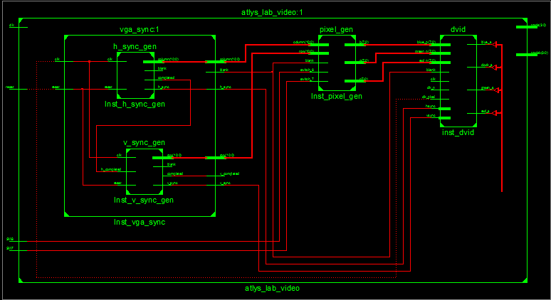
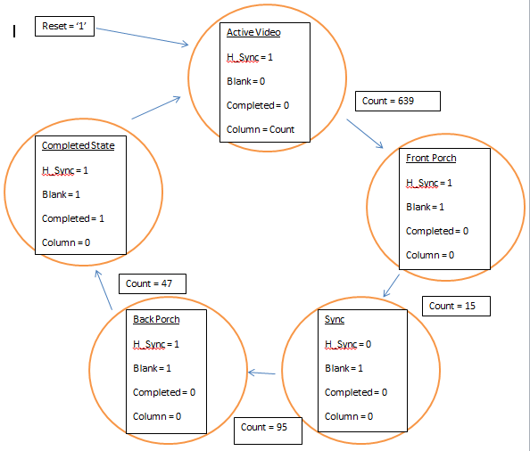
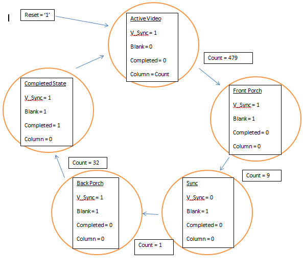

#Lab1
====

##VGA Driver
Using VHDL to drive a test screen to using an HDMI to VGA cable. The VHDL code uses a top level module that instantiates other modules. 

#Implementation

- Block Diagram for the Lab


- This lab used D flip flops for states (current and next) as well as for the buffers.
  - Example of a Flip Flop in VHDL
``` VHDL
-- state register
	process(clk, reset)
	begin
		if (reset = '1') then
			state <= idle;
		elsif(rising_edge(clk)) then
			state <= state_next;
		end if;
	end process;
```

- H_sync diagram


- V_sync diagram


# `atlys_lab_video`
The top level module. This instantias vga_sync and pixel_gen.

# `vga_sync`
This connects v_sync and h_sync. It instantiates both of them

# `v_sync_gen`
This generates the vertical signals. It cycles throught the 5 states that are in the state diagram. It uses three flip flops for next state logic, count logic and reset logic.

# `h_sync_gen`
This generates the horizontal signals. It cycles throught the 5 states that are in the state diagram. It uses three flip flops for next state logic, count logic and reset logic.


# `pixel_gen`
This assigns RGB to different values to display different colors. The higher the value, the higher the intensity.

# Testing and Debugging
- The typical method of coding everything and waiting until the last minute provided to be problematic. Finding all of the spelling and syntax errors at the end.
- The biggest problem that I encountered were my sensitivity list. I usually forgot to put the clk or something else in there which prevented the code from working.

# Conclusion
- VHDL is drastically different than other traditional programming languages. Following the typical standards that are set by VHDL solves a lot of the problems. Flip Flops are surprisingly important, much more than I originally thought. One of the biggest things I learned is to break up the lab and to do it in parts and ensure that they are functioning beforehand.

